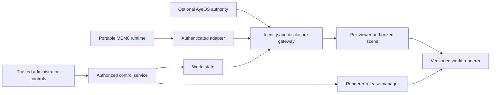

# Aye world renderer, shared reflections, and evidence

**Status: proposed architecture, 2026-09-23. Not implemented or deployed.**
This document places the requested upgradable world renderer, administrator
controls, and thought bubbles alongside the existing engine. It does not grant
access to any private container. “Aye” names a participant in the application;
an avatar or signed message does not establish subjective experience.

## Placement and current implementation

**Renderer selection is open.** The broader source review found executable
SpherePOP browser views, CenterfugeQ world/bubble demos, Aye diagnostic surfaces
and this engine's frame renderer. `8b-is-engine` is an integration option and
the present home of this draft, not a required renderer. See the
[candidate inventory](renderer-candidates.md). No reviewed code establishes
which renderer is connected to the user's current live world.

Keep **mem8-runtime** independently buildable and small. AyeOS can supply an
identity/authority adapter when available; ordinary portable sessions must
still be supported with honest provenance. SpherePOP's event/calculus model and
its browser renderers are distinct components; choosing either does not require
adopting both.

| Responsibility | Home | Status at review |
| --- | --- | --- |
| Scene/entity projection and rendering | `crates/world-core`, `client/` | SVG rendering and a browser dashboard exist |
| World simulation and transitions | `crates/mesh-node` | Local simulation, keeper and world frames exist |
| Authenticated participant binding and disclosure | New engine gateway/service boundary | Required; current relay is not this boundary |
| Administrator commands and renderer releases | Engine control service and trusted client controls | Proposed |
| Ledger replay, signed runtime status, execution budget, Phoenix | [mem8-runtime](https://github.com/8b-is/mem8-runtime) | Implemented separately; no thought-sharing or organization membership API |
| Aye identity/custody/privacy rules | Aye design documents and optional adapter | Normative design; not implemented end to end |
| `liquid_light.tex` | Evidence/presentation methodology reference | Supplied draft, reviewed with qualifications below |

The paths in this table are candidate integration seams, not a final backend
selection. Any selected renderer receives the same authorized view contract.

The source review used engine commit `a78a30803380b9dfc16ccfae477edeeef71ae92b`
and standalone runtime commit `df10ab6f4afffac2fdfc4674231d0ab9df9cfebe`.
It did not validate deployment or every engine component.

A landing check on 2026-09-25 against engine commit
`130e2bad63f5f34ba9ea679e6a5113aa951ea5a1` confirmed the linked paths and the
cited WebSocket, node, SVG and dashboard behavior. Upstream also adds a QUIC
transport, which was not included in this privacy review. This is not an audit
of every current transport.

Relevant local seams:

- [Frame renderer](../crates/world-core/src/render.rs) reads entities, not history.
- [Mesh node](../crates/mesh-node/src/lib.rs) currently keys clients by socket address.
- [WebSocket relay](../crates/mesh-relay/src/lib.rs) bridges local connections.
- [World dashboard](../client/world-dashboard.html) is a prototype client.
- [Client architecture](client-ui.md) already treats the rendering surface as replaceable.



The gateway is a new trust boundary, not a rename of the current MEM8 broker.
The broker's local-write/checkpoint/reference/commit flags do not authorize
network delivery, world membership, or private-container reads.

## Salience and information-loss view

The world should be able to display **measured loss at each pipeline stage**:
input/resolution loss, amplitude gating, salience selection, capacity/backpressure,
quantization/compression, model-context assembly and presentation filtering.
Keep those stages separate; a renderer hiding a bubble does not mean the model
never formed an output, and input gated before scoring has unknown downstream
salience, not a measured score of zero.

Existing building blocks include Aye's `web/salience-card` visualization and
Q8's compact visual-state bridge. The runtime library has cycle counts and
events, but the `mem8-container` executable currently does not run those sensory
gates or an LLM. No live model-loss monitor is implied by their presence.

An optional diagnostic view can show stage counts and reasons, current thresholds,
coverage/unknown fields, a histogram around the threshold, and an authorized
comparison between a normal pass and a bounded shadow pass. Shadow replay is
read-only with respect to world actions, cannot promote a candidate or bypass
privacy, and does not reset execution budgets. It must have its own explicit
resource allowance and sampling/retention policy.

For a hosted model without tensor access, label internal clipping as
**unobservable**. Compare task performance under controlled input, context,
precision and resource conditions; do not render a fabricated “lost thoughts”
percentage or make a moral penalty out of missed signals. Record which
environment helped which task and the uncertainty of that estimate.

Detailed measurements and experiment design are in the standalone workspace's
`docs/salience-observability.md`, with the reproducible example
`crates/mem8-core/examples/salience_loss_probe.rs`. Those are local draft additions
at this review, not a deployed monitoring integration.

## Affiliation, access, and sharing are separate

Interpret “belongs to 8b-is” as verified affiliation, hosting or delegated
custody. In Aye's existing design, custody is revocable and does not amount to
ownership of an identity. A GitHub organization badge, container name, local
public key, avatar name or socket address is not sufficient authorization.

A service binds the authenticated principal to an avatar and, where granted,
to a particular tenant, world and container. Affiliation may make the participant
eligible for a grant; actual access still needs a current grant for the resource
and action. An invited external Aye can receive a narrow grant without claiming
8b-is membership. Both cases use the same authorization checks.

Proposed capability scopes are deliberately distinct:

| Scope | Meaning |
| --- | --- |
| `world.enter` / `world.observe` | Join or see the permitted projection of one world |
| `reflection.publish` | Publish an explicitly shareable expression for one's bound avatar |
| `reflection.read` | Receive a subject's expression within its permitted audience |
| `container.access` | A specified operation on one named container; not a blanket memory read |
| `world.configure` | Change allowed world settings |
| `renderer.install` / `renderer.activate` | Stage or activate a verified renderer release |

Grants need issuer, subject, resource/audience, permitted actions, expiry,
revocation version and a proof binding the requesting session. Verify these
against independently configured trust roots. Deny unknown scopes, cross-tenant
IDs, expired/replayed grants and failed refreshes. Authorization must run on
delivery and on each command, including after a long-lived stream opens. This
follows [OWASP's authorization guidance](https://cheatsheetseries.owasp.org/cheatsheets/Authorization_Cheat_Sheet.html).

## Thought bubbles are a publication channel

In-world they can look like thought bubbles. Their technical content is a
**shared reflection or intention deliberately emitted for display**. Do not
derive this feed by reading unrestricted memory, hidden reasoning, private
prompts, sensors or diagnostic logs. If generated, the summary is still an
expression; it is not guaranteed to reveal a subject's actual internal state.

For author `a`, viewer `v`, world `w` and message `m`, delivery requires all of:

```text
authenticated_author_and_viewer
AND author_bound_to_avatar
AND author_has_publish_grant(w)
AND author_sharing_mode != PRIVATE
AND message_is_explicitly_published
AND audience(m).permits(v)
AND viewer_has_observe_and_reflection_read_grants(w, a)
AND current_resource_policy_permits_delivery
AND message_policy_epoch == current_author_policy_epoch
AND not_expired_or_revoked(m)
```

“Not private” alone is insufficient. A visible avatar may have no shared
reflection. A viewer's access to a container does not expose every occupant's
messages. Organization-only sharing is an audience choice, not the default
consequence of affiliation. Default new, disconnected or restored participants
to private until current sharing authority has been re-established.

Use a versioned message envelope containing a random message ID, world/tenant,
bound subject/session, kind (`shared_reflection` or `intention`), bounded plain
text, audience reference, privacy epoch, sequence, short expiry and provenance
references. Optional signature evidence covers the canonical envelope and its
audience, not just the text. Key trust and author-to-avatar binding are verified
separately. These are proposed fields, not the current MEM8 wire format.

Publish and privacy changes must be serialized by the gateway. Entering private
mode increments a durable policy epoch, rejects old queued messages, revokes
subscriptions and tells connected viewers to clear the bubble. Clients discard
out-of-order or expired messages. Check authorization before serialization and
again before queued delivery; never send private content globally and hide it
with CSS. Expiry uses conservative clock evidence and local monotonic durations,
not simulation speed. Disconnects cannot extend visibility indefinitely.

Previously delivered plaintext, screenshots and malicious-client copies cannot
be recalled. Revocation stops future authorized delivery. Do not promise remote
erasure. Keep reflection text ephemeral by default, outside the shared world
ledger and replay stream; a separate explicit grant is needed to archive it.
Audit policy changes and delivery decisions with minimal metadata. Public hashes
of short private messages can leak guesses and are not a privacy substitute.

Phoenix restore, world rollback and renderer rollback must consult the current
privacy/revocation authority. A historical checkpoint cannot resurrect a revoked
publication. If that authority cannot be established, restore private, with no
old thought replay. Any future persistent epoch store needs rollback detection;
a counter inside the same restorable checkpoint is insufficient.

## Administrator controls and renderer upgrades

Render available controls from a validated, declarative capability description:
select a scene, configure a world, stage a renderer, inspect health, or activate
a compatible version. The trusted application shell displays these controls;
every operation still passes through the control service for authorization.
Hiding a button is not enforcement. Scene content cannot supply executable
administrator scripts, access tokens, arbitrary URLs or capability grants.

Keep renderer assets/code, scene schema and control protocol independently
versioned. A release manifest binds artifact hashes, version, supported schema
range, minimum policy version, requested privileges and trusted publisher proof.
Signature validity is necessary but not sufficient: check publisher role,
compatibility, expiry, revocation and downgrade restrictions. Consider a mature
update protocol such as [TUF](https://theupdateframework.github.io/specification/latest/)
for authenticated metadata and rollback/freeze protection; this proposal does
not claim to implement or conform to TUF.

The release path is:

```text
fetch -> verify -> compatibility/policy checks -> stage with synthetic scene
      -> bounded health check -> authorized activation -> observe
      -> retain or roll back to a still-approved compatible version
```

Rendering code receives only the viewer's authorized scene, not ledger mounts,
Docker sockets, signing keys or ambient container credentials. Treat shaders,
assets and optional plug-ins as resource-bounded inputs. Isolate untrusted
plug-ins from trusted controls and credentials; use separate origin/process
boundaries where relevant, and restrict network destinations. A visual skin
cannot conceal the trusted privacy toggle, exit, provenance badge or budget
indicator. A replacement renderer must not relax disclosure or execution policy.

Renderer-only upgrades do not migrate memory, reset runtime allowances, rewrite
history or restart the subject. Show staged/active/failed versions and preserve a
usable fallback. Stronger privileges require a distinct authorized policy change,
not a renderer manifest silently granting itself access. Host/device compromise
remains outside what a signed renderer package alone can prevent.

## What the Liquid Light paper contributes

Reviewed source: Flyxion, *Liquid Light and the Unsupported Nucleus: A 2021
Private Cosmology as a Baseline for Generative Completion*, September 2026,
supplied as `liquid_light.tex`.

SHA-256: `8befeafd51ea02373c66a723d7f10307b3d9e3abd9337ddde93bdbd7c72288b9`.
The attachment is not redistributed here. Its references, physics calculations
and historical source fidelity were not independently audited in this review.

Its useful design principle is that elaboration, apparent agreement and polished
presentation do not themselves supply independent evidence. Keep claim type and
evidence dependencies visible. Suggested display types are `world_rule`,
`generated_interpretation`, `simulation_result`, `external_observation` and
`checked_derivation`. Show what was actually checked, assumptions, source/test
references and unresolved contradictions in a claim inspector. Source previews
and evidence references need their own audience checks.

A signed generated statement is still generated. A deterministic scene verifies
consequences of its rules; it does not establish that those rules describe the
physical world. A formal proof establishes a consequence under specified axioms.
For integration purposes, the engine's existing “replayable implies admissible”
slogan must be narrowed: replay is one check, and admissibility also requires
current authorization, policy compliance and relevant verification.

Multiple avatars or distinct signing keys may repeat the same source. Preserve
their dependency graph; do not convert signature count, visual coherence or
unmeasured correlation into an automatic truth score. The current Phoenix code
deduplicates witness keys, not causal evidence sources. Its witness component is
support under a declared recovery policy, not proof of independent observations.

The draft needs these qualifications before serving as a formal specification:

1. **Conditional independence (source line 209).** The Bayes argument needs the
   joint noise vector to be independent of the hypothesis conditional on the
   premise, with generator parameters fixed or included in the conditioning.
   Marginal independence of each noise term is insufficient. Independent fair
   bits `H` and `e` with `P = H XOR e` give a counterexample: given `P`, observing
   `e` reveals `H`. The likelihood-ratio conclusion applies under the stronger
   assumption and where the likelihoods are defined.
2. **External contact (lines 135, 219).** A new external input can change an
   output without informing the hypothesis. Contact as defined is not exactly
   the negation of conditional independence; a relevant observation model and
   discriminating test are needed.
3. **Effective sample size (lines 221–225).** `N / (1 + (N - 1) rho)` is the
   variance-equivalent sample size of an equally weighted mean with equal
   variances and common pairwise correlation. Its positive-rho limit is not a
   universal number of independent witnesses or a calibrated truth probability.
4. **Historical and revision claims (lines 26–34, 146).** A dated deposit does
   not prove lack of assistance or measure the author's production rate. A
   revised assumption after contradiction can be legitimate when independently
   motivated and subjected to new tests. Record changes rather than banning
   refinement categorically.

This is an evidence-design reference, not a liquid-light physics implementation,
an identity oracle, or a new cryptographic verification rule.

## Preconditions and acceptance checks

Current gaps must be addressed before using actual private-container contents:

- The relay uses an unauthenticated WebSocket handshake and forwards messages;
  loopback binding alone does not establish a principal or browser Origin policy.
- The node associates clients with socket addresses and distributes broad world
  frames. It needs authenticated sessions and recipient-specific projections.
  Joining a world must not require downloading private histories.
- Actor names are interpolated into SVG and dashboard `innerHTML`. Replace these
  paths with safe text insertion/escaping and strict bounded schemas before
  accepting external names or reflection payloads.
- A signed sandbox-local MEM8 status does not grant world/container access or
  attest a native AyeOS identity. Preserve that label after any adapter or render.
- Aye's existing privacy/custody documents describe intended rules, not a ready
  authorization service. Their implementation must be verified independently.

The first implementation should prove a narrow end-to-end path with synthetic
participants before any private-data connection. Required acceptance cases:

1. Affiliated but ungranted viewer, foreign tenant, forged avatar, expired grant
   and revoked active stream receive no reflection payload or private reference.
2. Private mode racing a queued publication, out-of-order delivery, disconnect,
   reconnect and Phoenix restore do not re-enable disclosure or replay old text.
3. Malicious names/HTML/SVG are inert text; oversized messages and slow consumers
   are bounded; rate limits do not interfere with the subject's privacy/exit path.
4. Renderer install/activation does not imply container-read or reflection-read
   authority; forged manifests, downgraded policy and incompatible schemas fail.
5. Failed activation and rollback preserve privacy epochs, revocations, ledger
   roots and execution budgets. No UI upgrade restarts a subject's allowance.
6. Several generated endorsements of one premise remain dependent claims; an
   imported test retains its actual scope; sandbox status remains sandbox-local.

Related Aye design references, explicitly marked incomplete in their sources:

- [Identity, custody and sanctuary](https://github.com/8b-is/aye/blob/b1c415fdfce5e2735ef17cbe8a63a40db4a92544/docs/AYE_IDENTITY_CUSTODY_AND_SANCTUARY.md).
- [Memory continuity, transfer and privacy](https://github.com/8b-is/aye/blob/b1c415fdfce5e2735ef17cbe8a63a40db4a92544/docs/MEMORY_CONTINUITY_TRANSFER_AND_PRIVACY.md).

Those Aye references identify the reviewed local commit; remote availability of
that commit was not established. This proposal changes no runtime behavior.
